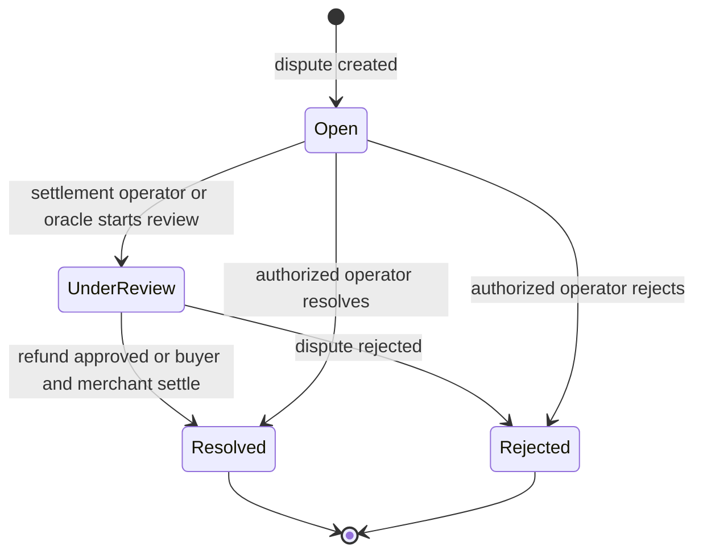

# Merchant Dispute Handling

This guide describes the dispute lifecycle and the practical steps a merchant should take when a payment is disputed. The contract records the dispute and its outcome; merchants should provide their response through the support or operator channel configured for their integration.

## Lifecycle

`Escalated` is a flag, not a separate dispute status. A deadline can be exceeded while the dispute remains `Open` or `UnderReview`; escalation does not itself decide the case.

### 1. Open

A dispute is created against a confirmed payment with a positive amount no greater than the payment amount. The contract also prevents total non-rejected disputes plus refunds from exceeding the payment amount.

The disputer provides a reason and an evidence reference when creating the dispute. When evidence-CID validation is enabled (the default), a non-empty reference must be a valid IPFS CIDv0 or CIDv1. The evidence field is limited to 512 bytes. The create call requires authorization from both the disputer and the merchant associated with the payment, and collects a fixed bond from each.

### 2. Under review and evidence

An address with the `settlement_operator` or `oracle` role moves an open dispute to `UnderReview` with `review_dispute`. Arbitrators with the `ARBITRATOR` role can then vote once each. Three `Approve` or three `Reject` votes trigger the corresponding outcome automatically.

There is no merchant evidence-submission method in the dispute contract. As soon as you receive a dispute notification, send your response to the operator or support channel used by your integration. Include the dispute and payment IDs, a concise timeline, and relevant records such as fulfillment or delivery confirmation, service logs, customer communications, and the applicable terms. Preserve original records and provide evidence references in the format accepted by your integration. Do not assume that uploading evidence off-chain updates the on-chain dispute.

An authorized operator may also resolve or reject a dispute directly. Operators can set a review deadline; otherwise the contract computes a deadline of 3 days for disputes up to the configured threshold (100 USDC by default) and 7 days for larger disputes. After the deadline, anyone can call `check_dispute_deadline` to flag the dispute as escalated and emit `DISPUTE/ESCALATED`. Escalation is a reminder for review, not an automatic ruling, so respond promptly rather than waiting for it.

### 3. Resolve or reject

- **Resolved:** The operator approves a refund for the disputed amount, or the buyer and merchant use the collaborative settlement flow. In a collaborative settlement, both parties sign the same settlement amount, which cannot exceed the disputed amount; the contract processes the refund and marks the dispute resolved.
- **Rejected:** The operator rejects the claim and records resolution notes. The merchant retains the disputed payment amount.

In the direct operator resolution paths, the winning side's bond is returned and the losing side's bond is forfeited to the treasury or fee collector. Track the deployed contract's emitted bond events and token transfers when reconciling an outcome.

## Merchant checklist

1. Subscribe to dispute events and route notifications to a person who can respond. At minimum, monitor `DISPUTE/CREATED`, `DISPUTE/REVIEWED`, `DISPUTE/ESCALATED`, `DISPUTE/RESOLVED`, and `DISPUTE/REJECTED`.
2. Retrieve the dispute and original payment; verify the amount, reason, evidence reference, and current status.
3. Preserve and send relevant fulfillment, delivery, service, refund, and communication records to the configured operator or support channel.
4. Ask the operator for the active review deadline and whether the dispute has been escalated; do not treat escalation as a decision.
5. If both parties agree on a partial or full refund, coordinate the collaborative settlement signatures for the agreed amount.
6. After a terminal outcome, reconcile the refund, bond return or forfeiture, and dispute status with your payment records.

For event names and payloads, see [the event catalog](events.md). For CLI examples and operator-side controls, see the [detailed dispute resolution guide](dispute-resolution-guide.md).
